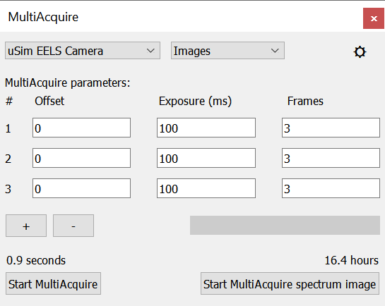
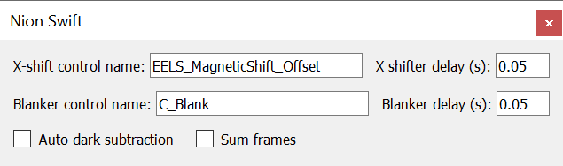

.. _user-guide:

User's Guide
============

.. contents::

.. _camera-panel:

Using the Camera Panel and Control Bar
--------------------------------------

Readout area is always specified in un-binned coordinates. Binning is applied to the data read from the readout area.

.. _scan-panel:

Using the Scan Panel and Control Bar
------------------------------------

.. _video-panel:

Using Video Panels and Control Bars
-----------------------------------

.. _synchronized-acquisition-panel:

Synchronized Acquisition (aka Spectrum Imaging / 4D Acquisition)
----------------------------------------------------------------
Synchronized acquisition is camera acquisition synchronized with scanning. Specific examples include spectrum imaging and 4D STEM.

Your system must be configured properly for synchronized acquisition. This may include physical triggering connections between cameras and the scan device. It may also include software connections to route the trigger connections.

To use synchronized acquisition, open the `Spectrum Imaging / 4D Scan Acquisition` panel using the `Window` menu.

Next, establish a context image by performing a scan with one or more channels enabled. Confirm the scan data is shown in a display panel and click on that display panel to ensure it has keyboard focus.

Next, select the type of data you wish to acquire, spectra or images, using the menu at the top right of the `Spectrum Imaging / 4D Scan Acquisition` panel.

You can perform synchronized acquisition on the full scan, a sub-area rectangle (possibly rotated), or on a line.

.. image:: resources/synchronized_acquisition_panel.png
   :scale: 50 %

Full Context Synchronized Acquisition
^^^^^^^^^^^^^^^^^^^^^^^^^^^^^^^^^^^^^

To perform a full scan, click on the context image and make sure no graphics are selected. Enter the desired scan width in the `Spectrum Imaging / 4D Scan Acquisition` panel, check the acquisition estimated time and size, and click `Acquire`. The context image will update during the acquisition process.

Sub Area (Rectangle) Synchronized Acquisition
^^^^^^^^^^^^^^^^^^^^^^^^^^^^^^^^^^^^^^^^^^^^^

To perform a rectangle scan, add a rectangle graphic to the context image (a quick way to do this is click on the `Subscan Enabled` in the Scan Control panel). Adjust the rectangle by dragging and adjust its rotation using the inspector. Now enter the desired scan width in the `Spectrum Imaging / 4D Scan Acquisition` panel, check the acquisition estimated time and size, and click `Acquire`. The *subscan* image will update during the acquisition process. If the *subscan* image is not visible, make it visible by right clicking in an empty display panel and choosing the desired channel with "Subscan" in its title.

Line Scan Synchronized Acquisition
^^^^^^^^^^^^^^^^^^^^^^^^^^^^^^^^^^

To perform a line scan, add a line graphic to the context image. After adjusting its position, enter the desired scan width in the `Spectrum Imaging / 4D Scan Acquisition` panel, check the acquisition estimated time and size, and click `Acquire`. The *subscan* image will update during the acquisition process. If the *subscan* image is not visible, make it visible by right clicking in an empty display panel and choosing the desired channel with "Subscan" in its title.

The resulting data will be a collection (one dimension) of your selected data type (spectra or image). You can display the data in its default mode (a spectra or an image) and scroll through the collection using the Ctrl-Right-Arrow and Ctrl-Left-Arrow keys. Or you can use the menu item `Processing > Redimension Data > Redimension to a Collection of 1 Image of Shape 400x2048` or similar to display an image with a collection index on one axis and the data dimension (energy) on the other axis.

.. _multi-acquire-panel:

Using the Multi-Acquire Panel
-----------------------------

This plugin allows you to acquire series of images/spectra or whole synchronized scans with multiple offsets and exposure settings.

Main window
^^^^^^^^^^^

Get the plug-in main window by selecting it from the "Window" menu.

The acquisitions can be set up with the table in the main window. Each returned data item corresponds to one line in the configuration table.
Use the "+" and "-" buttons to add or remove lines. The first column shows the data item number, which will also be added to
the titles of the results. You have the option to acquire the programmed sequence as individual spectra/images or
as spectrum images/4D images by clicking either on *Start MultiAcquire* or *Start MultiAcquire spectrum image*.
Note that for individual spectra/images, the progress bar will only update once per line in the configuration table (i.e. if only one spectrum is defined it will jump
straight from 0 to 100%). For spectrum images/4D images, the progress bar will update once per acquired line of a spectrum image.
The left dropdown menu at the top of the main window lets you select the camera that is used to acquire the data.
The right dropdown menu lets you select between different output styles for the acquired data:

- *Spectra:* Bins the camera frames in y-direction which results in spectra or spectrum images being returned.
- *Images:* Returns the full camera frames which results in images or 4D data sets being returned.
- *MultiEELS Spectra:* Also bins the camera frames in y-direction but additionally calibrates the returned data
  in e\ :sup:`-`\ /eV/s. If you are not acquiring a spectrum image, this mode will also create one additional data
  item that contains all acquired spectra as multiple line plots (see image below for an example).

The plug-in will always create one result data item per line in the configuration table. If *frames* is larger than 1,
the corresponding result data item will be a stack of the data type that is configured via the dropdown menu.

.. image:: resources/multi_acquire_output_stacked.png

Settings Window
^^^^^^^^^^^^^^^

You can access the settings menu via the button in the top-right corner of the main window.

In order to set the offsets, the plugin needs to know which control it has to change in AS2. Type the name of
this control into the *Offset control name* field. If the field is empty, offsets are disabled, regardless of what
is configured in the main window.

The checkboxes in the bottom row allow you to configure how the data will be returned:

- *Auto dark subtraction* will blank the beam after the acquisition is finished and repeat it (with the exact same settings). This data will be then be used as dark images for the actual data.
  Make sure *Blanker control name* is set correctly, otherwise this mode will fail. Note that this settings has no effect for spectrum images as it will always be deactivated in this mode.
- *Sum frames* will sum all frames that were acquired for each spectrum (as specified by the column *frames* in the main window). If this is off, the plug-in will return a stack for each spectrum.

.. _multiple-shift-acquire-panel:

Using the Multiple Shift Acquire Panel
--------------------------------------
This plugin allows you to acquire a stack of spectra with energy offsets between each frame. A spectrum stack of a chosen number of frames can be acquired, have the dark reference subtracted, and then aligned through automatic cross-correlation and summed. The integration time for each frame is taken from the current set-up for the camera. The plug-in returns a spectrum stack, the aligned and summed spectra, and a line profile over a cropped region of the aligned and summed spectra.

Main Window
^^^^^^^^^^^

The main control panel for the plug-in can be found in the "Window" menu.

.. image:: resources/multiple_shift_eels_acquire_main_window.png
   :width: 350

The control panel allows the following options for the user:

- Dropdown menu: The camera to use for the stack is chosen by the drop-down menu (in the image shown, "uSim EELS Camera" is chosen). 

- *Number of frames:* allows the user to choose the number of frames to acquire and sum by entering a positive integer into the textbox.

- *Energy offset/frame* allows the user to enter a number (integer or decimal) in the "Energy offset/frame" textbox: each successive spectrum will be offset by the input value in eV. If 0, no energy offset will be applied and the camera will not pause between acquisitions.

- *Apply dark reference?* allows the user to choose whether or not a dark reference should be applied to the acquired spectra. If the box is ticked, the program will apply a dark reference; if the box is not ticked, no dark reference will be applied to the acquired data (for example, this might be desirable when acquiring a dark reference to save or to characterize the detector response). The dark reference to be applied may be acquired (averaging over the same number of frames given in *Number of frames*) or loaded from a file, depending on whether a path to a valid file is given in the *Dark reference file:* text entry box.

- *Apply cross-correlation?* is a checkbox that allows the user to choose whether or not the spectrum stack will be aligned before summing. If the box is ticked, the cross-correlation of each spectrum will be calculated relative to the first spectrum, and the stack will be aligned and then summed. If the box is not ticked, no cross-correlation will be calculated and the stack will not be aligned before summing (*e.g.* desirable when acquiring a dark reference or detector response).

- *Dark reference file:* is a text entry box that allows the user to provide a filepath to a saved file that holds data representing the dark reference to be applied. It is the user's responsibility to make sure that the dark reference was acquired with the same acquisition time as the stack. If no file is provided or the file does not hold valid data, and the *Apply dark reference?* box is ticked, then a dark reference will be acquired automatically after blanking the beam. If the *Apply dark reference?* box is unticked, any file included in this box will be ignored and no dark reference will be applied.

- *Sleep time* allows the user to enter a positive number. The detector will pause for this number of seconds in between frames if a non-zero energy offset is given, to allow the afterglow from the previous frame to die away. If a dark reference is acquired, the detector will also pause for this number of seconds after blanking the beam and before acquiring dark reference frames.

.. _acquisition-recorder-panel:

Using the Acquisition Recorder Panel
------------------------------------
